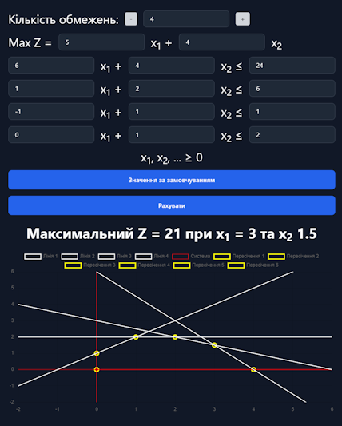

# MMDO Website

### ** My first experience with JavaScript. Sorry for the code chaos! 😅 **

## 📊 Graphical Method for Solving the Simplex Method
This project implements the graphical method for solving linear programming problems using the simplex method. It is part of a coursework project for the subject "Mathematical Methods of Operations Research."

## 🔹 Features
✔️ Visualization of the feasible solution region 
✔️ Graphical identification of the optimal solution 
✔️ Support for various objective functions and constraints 
✔️ Clean, modern design 
✔️ Responsive layout 
✔️ Fade-in animation 
✔️ Built with HTML and Tailwind CSS 

## 📌 Technologies Used
- JavaScript
- Victor.js
- Chart.js
- HTML5
- Tailwind CSS
- CSS animations

## Preview

